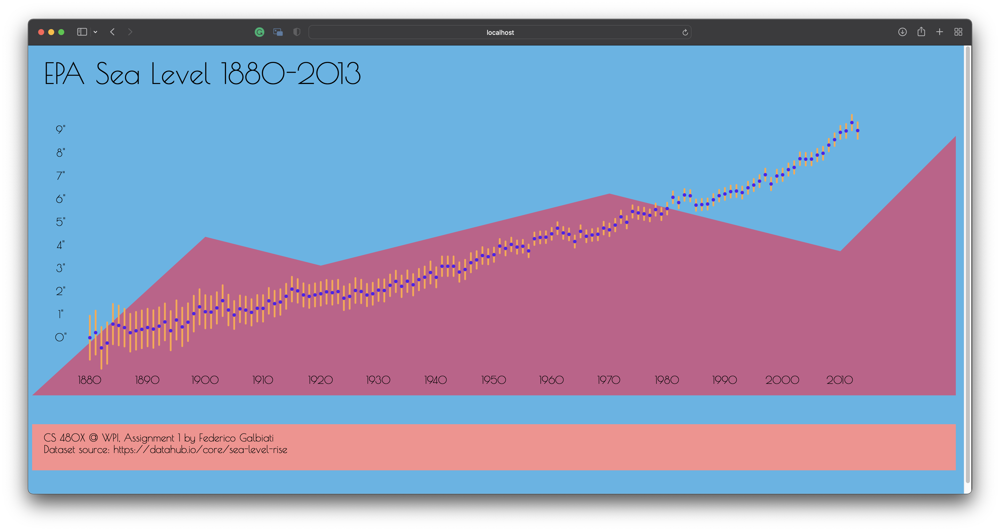
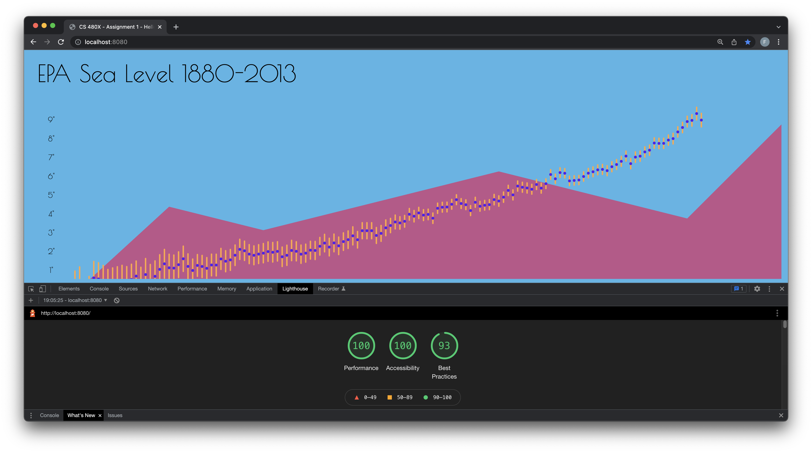
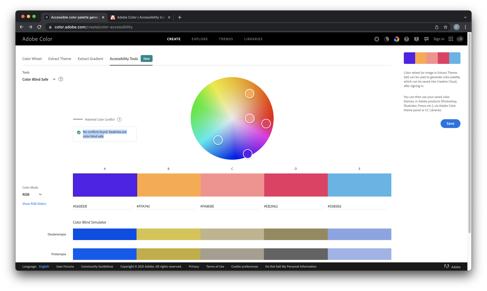

Assignment 1 - Hello World: GitHub and d3  
===

### Links
Repository: [https://github.com/fedeit/a1-ghd3](https://github.com/fedeit/a1-ghd3)
 
README: [https://github.com/fedeit/a1-ghd3/blob/master/README.md](https://github.com/fedeit/a1-ghd3/blob/master/README.md)
 
GitHub Pages: [http://fedeit.github.io/a1-ghd3/index.html](http://fedeit.github.io/a1-ghd3/index.html)

### Overview
<i>Made by Federico Galbiati (fedeit)</i>
 
For this assignment I created a small plot of data by reading a CSV dataset of the sea levels from the EPA available publicly at [https://datahub.io/core/sea-level-rise](https://datahub.io/core/sea-level-rise). The only framework used is d3.js. All code was created based on the starter code used in class from demos `d3start` and `exo-inclass`. The dataset is plot using circles for the data points, and lines for the upper and lower margin of error for each point. I then decorated the page using a polygon and adding a footer. Finally, I introduced custom fonts, an accessible color palette, text, and animations on the data points that enlarge the items on hover.

### Requirements
- Circles:
    - I used a circles for the datapoints, custom radius and color, and center position
    - I also applied a transition on hover in/out which changes the radius from 3px to 5px and viceversa
- Rectangles:
    - I used a rectangle to create a footer at the bottom of the page.
- Lines:
    - I used lines for the error bound lines for each data point. The lines have a custom color, round corners, and line width
    - I also applied a transition on hover in/out which changes the line width from 3px to 5px and viceversa
- Polygons:
    - I created one large polygon with seven points what represents an upward trend in the data. I also applied a custom color to it
- Different colors:
    - I created a custom palette with color.adobe.com and made sure it is accessible for all people with visual disabilities. These colors were applied to all the elements of the UI.

### Technical Achievements
- Data CSV import:
- Animation on hover:
    - I grouped the circles and lines for each data point using a `<g>` element. I then applied mouse events on the graphical elements on mouse hover. The mouse events trigger animations on the respective circle and line elements for the group, and modified the radius and line width to make them larger.
- Lighthouse tests:
    - I tested the website using the Google Lighthouse tests and scored 90+ on Performance, Accessibility, and Best Practices (screenshot below)

### Design Achievements
- Accessible color palette (screenshot below):
    - I created a custom color palette of five colors using [https://colors.adobe.com](https://colors.adobe.com). I also validated the palette for accessibility using [https://colors.adobe.com/create/color-accessibility](https://colors.adobe.com/create/color-accessibility) to make sure it works for people with color blind people.
- Text items:
    - Although we haven't used text elements yet in class, I decided to experiment with them. I created a title, footer notes, and axis labels.
- Custom font from Google Fonts:
    - I used a custom font from Google fonts that I found more visually appealing than the default fonts. Specifically, I used [Poiret One](https://fonts.google.com/specimen/Poiret+One). I included it by using a `<link>` tag.

