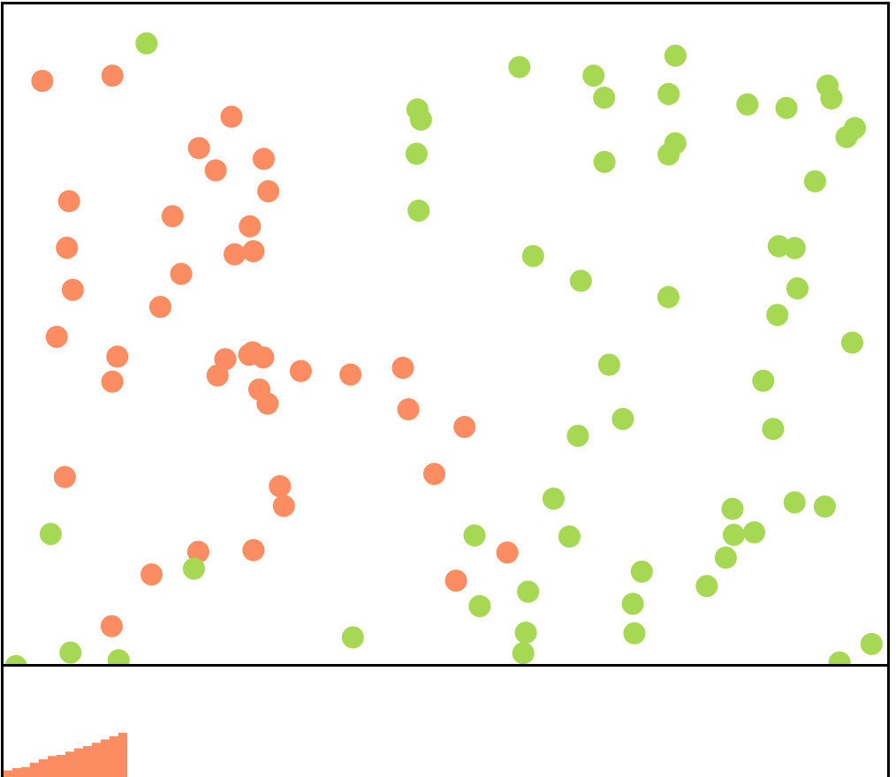

Assignment 1 - Hello World: GitHub and d3  
===

For assignment 1, I chose to dive into data visualizations and make a simpler version of the infectious disease simulator in the New York Times. 

The population will always consist of 100 circles which randomly move around the screen, with one of them infected (red) to start. When an infected circle moves within a given distance of a non-infected circle, it has a chance to infect it. This distance and chance can be adjusted using the text box. The distance roughly represents the contagiousness of the disease (more contagious diseases can travel longer distances to infect) and the chance of infection could represent the amount of measures taken against the disease (vaccination, masking, etc).

The bottom section of the visualization contains a bar chart that updates in real time, showing the change in the number of infected circles over time. This is a "sliding window" view that looks at the most recent 100 iterations. It is interesting to play around with the parameters and see how this changes the exponential infection curve - for example, an infection percentage of 50% isn't very different from 100% but around 10% will take significantly longer.

I did not use any starter code from this assignment and wrote it myself. However, in order to generate some graphics I extensively used the D3 documentation, particularly where animation was concerned. 

Github Pages Link: https://iancoolidge0.github.io/a1-ghd3/index.html

Technical Achievement Section
=============================

This project goes above and beyond the D3 project requirements, including interactivity, animation, and data visualization. The animations involved in this project are relatively advanced as they require constant updates on a timer to move the circles, and checking collisions at each step. The combination of the basics of D3 with these features means that this project will be helpful for allowing me to understand how to build more advanced D3 visualizations with animation and interactivity in the future.

Design Achievement Section
==========================

This project utilizes the Set2 color scheme for the red and green tones from the observableHQ site. In addition, the graph at the bottom provides a real-time explanation of the data which utilizes the principles that we discussed in Lecture 2 to make the data easier to read.

