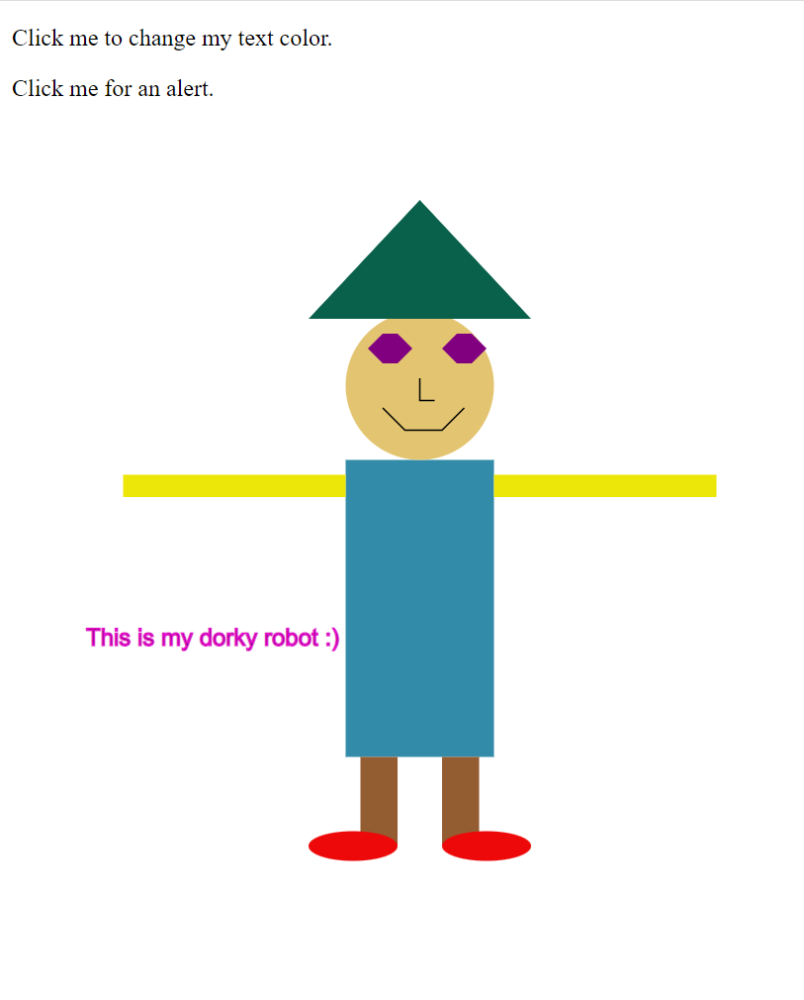
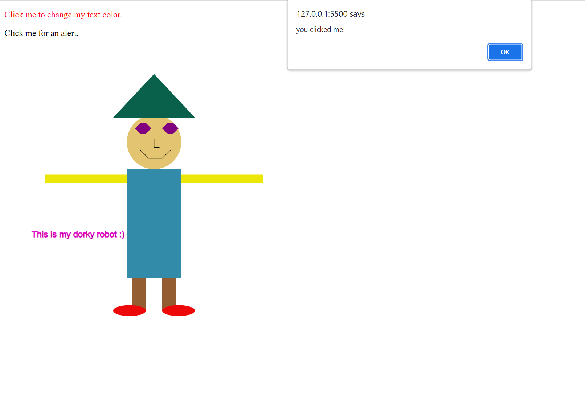

Assignment 1 - Mary Barsoum 

gh-pages: https://github.com/BarsoumRose/a1-ghd3/blob/master/index.html

To practice using shapes and colors I decided that I wanted to make some sort of drawing. So I made a robot! he's quirky in his own ways but thats okay :) 

The robot consists of different shapes inclduing, rectangles, circles, hexagons, ellipses, and a triangle! There are also som features drawn with lines as well. To keep it funky, each shape is a different color, courtesy of the google hex color picker.

Technical Achievement: 
To add some sort of interaction feature, I decided to create two onclick actions. 
the first paragraph in the top left hand corner that says "click me to change my text color" ---> changes the text color on click to be a red. 

The second paragraph in the top left corner says "click me for an alert" 
On click, an alert message appears. 

the before and after images of click are shows below.

 

Design Achievement: 
Rather than putting random shapes on the screen, I made an actual picture. I also experimented with how to make different shapes with lines, for example the smile. 