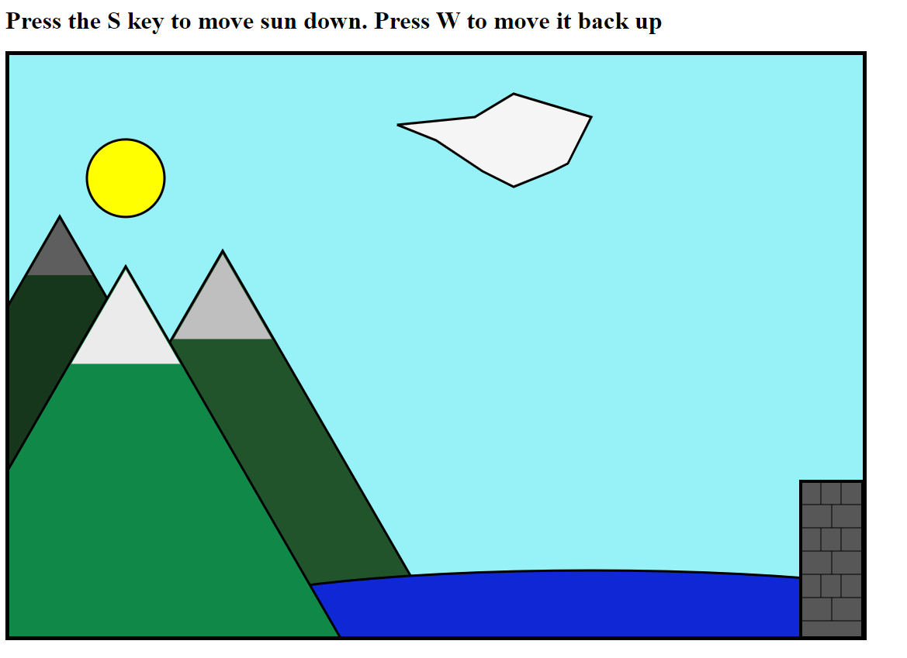
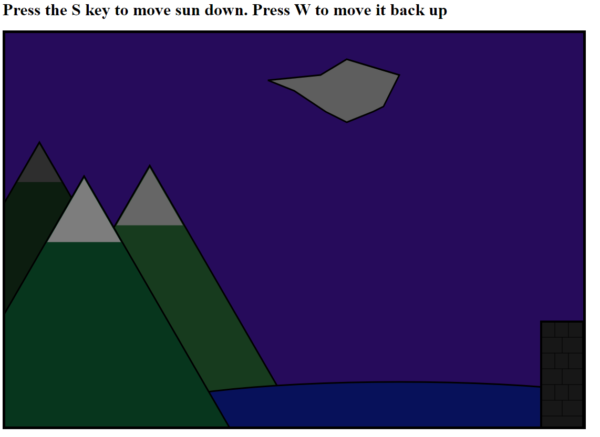

Assignment 1 - Hello World: GitHub and d3  
===
Link to gh-pages
https://obliiviion.github.io/

Daytime screenshot

Nighttime screenshot

Image description:
I used various shapes to create a scene. There are 3 mountains, a sun, a cloud, a pond, and a castle wall.
Each element is created from basic shapes. 
The mountains and their tops are all triangles. The sun is a circle. The pond is an ellipse. The castle wall is a rectangle. The cloud is a polygon.
To add detais to each elements, I used other shapes. The mountains are composed of 2 triangles, one for the base, one for the snowy top.
The castle wall is made of one main rectangle and of several lines drawn within the rectangle. The lines are used to add the details and appearance of bricks on the wall.

I started with the code we had in class and then searched for help online.
I found shape assistance at https://lucidar.me/en/d3.js/part-06-basic-shapes/ and http://www.d3noob.org/2014/02/d3js-elements.html
For moving the sun up and down, I used 2 resources to find out how to make the shape move and how to detect keyboard input.
Making shape move : https://www.tutorialsteacher.com/d3js/animation-with-d3js
Detecting input: https://developer.mozilla.org/en-US/docs/Web/API/KeyboardEvent

Technical Achievement:
My goal in this project was to have some sort of user controlled moving element.
In my first couple of commits to this project, I started out by trying to make a game of pong. 
During that, I was able to make 2 moving paddles on the screen. 
When I changed the concept of my project, I decided I still wanted some moving element and decided to make the sun that element.
Using references that I indicated in the previous section under "Making Shape move", I was able to create a sun that moved. 
I didnt want the sun moving randomly or only once however, so I decided to make it user controlled. I used the code under
"Detecting input" to find out how to get inputs from my keyboard to control the sun. I played around with different keys 
and timings and speeds for the sun should move. I also programmed it so that the scene would change when the sun was up or not to 
indicate daytime or night time. 
Using the W and the S key on the keyboard, we can control the movement of the sun.
When the sun is high up, the scene depicts daytime.  
When the sun goes down, the scene changes and every color in the scene gets darker to show it is nighttime.

Design elements
My design elements tie into my Technical Achievements.
I wanted to create a scene with mountains and some sort of building. I settled on mountains, a pond, and a castle. 
I used basic shapes to make each element, but I wanted to add more depth to the image. So, to the mountains, I first atted a snowy
top. And then, I changed the colors of each mountain to try and reflect which ones were in the foreground and background.
Next I created the pond. The pond is an ellipse, which is a circle with elongated ends. 
Then, I created the wall. This wall is one rectangle with lines drawn over it. The lines are there to give the wall a detail of bricks.
I also created a cloud out of a polygon. When placing the points for the polygon, I tried to make the shape as cloud like as possible.
After the scene was set, I made the scene change color based on the hieght of the sun. When the sun is up, it is a normal, bright day.
Once the sun goes down, the colors of all the different shapes on the scene change to be darker colors to show that it is nighttime.