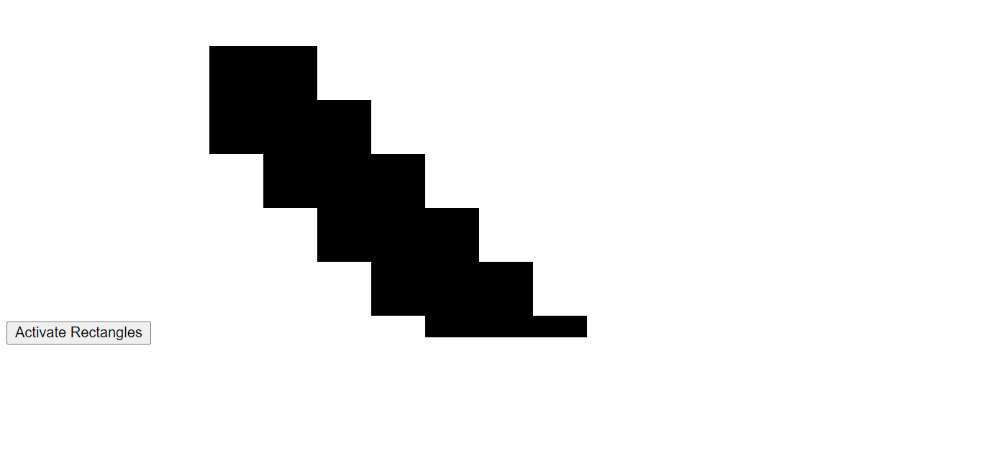
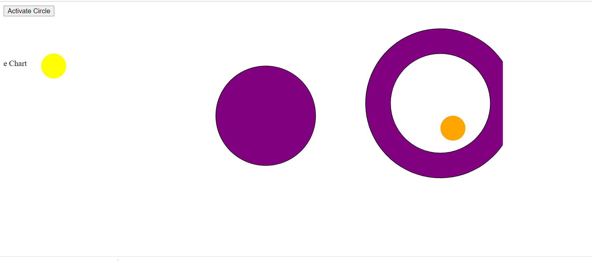

Assignment 1 - Hello World: GitHub and d3  

If you want to the line chart, run this svg and comment out the others in the code (this svg is present in the code as well ):
    svg width="700" height="500"

Source Code used:
    Rectangle/Circle animation: https://www.d3-graph-gallery.com/graph/interactivity_transition.html

    Arc Chart: https://www.d3-graph-gallery.com/graph/shape.html

    Line Chart: https://www.educative.io/edpresso/how-to-create-a-line-chart-using-d3

link: https://github.com/amosr2002/a1-ghd3/blob/master/index.html

Design Achievement:
I think the design achievement I achieved is unique because I took inspiration from animations from d3 source code, but I changed the shaps and colors to make the animation unique. The moving circle animation was unique, because it first started as a small circle but the ending animation had one circle in the middle, and two circles on the right and left, and the right circle was inside another graphic which was a changing color arc.

I also think the movingRectangle graphic was unique because it started out as different rectangles, and in the source code the shapes were never combined and never changed color. But in my code, I allowed the rectangles to change color and combine as one big rectangle throughout the animation

My line chart also fit to a more curved data, and had a green fill. I thought this would be better than a plain line graph

Technical Achievement:
I think the technical achievements I achieved was learning how to use transitions and changing the durations on which I wanted the transitions to occur. I also got used to adding dictionary/array data to my graphics, to make more interactive graphics. With the given data, I was able to create multiple rectangles, to then create an animation to combine them all together.

I also was comfortable in adding text/path elements to my visuals

